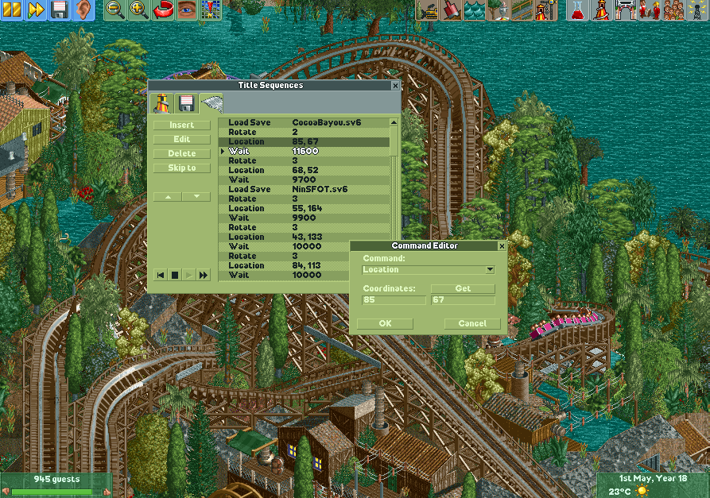

# OpenRCT2 Title Sequence Editor

Title sequence editor plugin for OpenRCT2. This allows you to create, edit and preview custom title sequences (`.parkseq` files) that are played on the title screen of OpenRCT2.

Formally built into the game, but now stripped out into an optional plugin.



## 🚀 Installation
1. Download the latest version of the plugin from the [Releases page](https://github.com/OpenRCT2/title-sequence-editor/releases).

2. To install it, put the downloaded `*.js` file into your `/OpenRCT2/plugin` folder.

    * Easiest way to find the OpenRCT2-folder is by launching the OpenRCT2 game, click and hold on the red toolbox in the main menu, and select "Open custom content folder".
    * Otherwise this folder is commonly found in `C:\Users\<YOUR NAME>\Documents\OpenRCT2\plugin` on Windows.
    * If you already had this plugin installed before, you can safely overwrite the old file.
    * Once the file is there, it should show up ingame in the dropdown menu under the map icon.

3. Once the file is there, it should show up ingame in the dropdown menu under the map icon.

## 🔨 Building
The plugin is written in TypeScript and requires compiling to JavaScript before it can be used in OpenRCT2. Ensure you have NodeJS and a package managed such as `npm` installed, then run the following:
```
npm install
npm run build
```

Then copy `out/title-editor.js` to your OpenRCT2 plugin directory.

If you want to automatically update the plugin when you edit and save the TypeScript code, you can run:
```
npm run watch
```
This will watch for changes to the source code in the background and automatically compile and copy the plugin to your OpenRCT2 directory. This is currently only configured for Windows.

Make sure you have hot reload enabled in OpenRCT2 so that OpenRCT2 will automatically reload the plugin.

## ⚖️ Licence
This plugin is licensed under the MIT licence.
